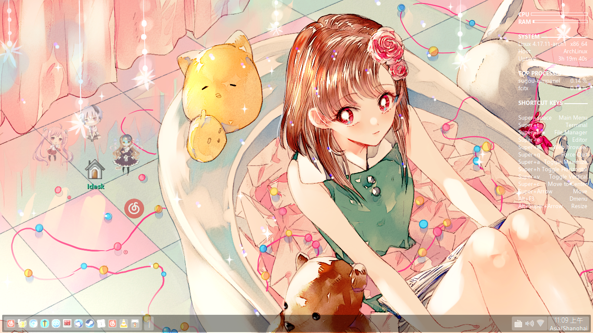

# Openbox-config

这是我的Openbox桌面默认配置文件

以 Arch Linux 为列：
sudo pacman -S openbox openbox-themes menumaker feh tint2 conky conky-manager fcitx idesk obconf lxappearance-obconf oblogout obmenu libfm dmenu idesk idesk-extras lxterminal pcmanfm network-manager-applet pcmanfm compton transset-df xcompmgr volumeicon xscreensaver-arch-logo fcitx-sogoupinyin archlinux-xdg-menu l3afpad geany geany-plugins xwinwrap gmrun dmenu obkey-git  epdfview leafpad 

部分东西我没注意到，可能有部分包没有装上去，比如alsa，这些东西是我以前在xfce上安装过的
archlinux-xdg-menu会自动帮你更新启动程序列表 
l3afpad文本阅读器 oblogout解决无法立即睡眠 
idesk解决部分图标不显示 
idesk-extras idesk工具箱
obmenu菜单列表编辑器 
menumaker自动创建与多个窗口管理器相对应的菜单，但是极少用的，除非重新定义菜单才会用到它  
feh设置壁纸 tint2面板相关，没有面板什么都不方便  
obconf设置gtk2主题，特别是tint2面板主题 
lxappearance-obconf作为gtk2主题的补充（很重要） 
network-manager-applet切换wifi网络 
pcmanfm文件管理器 compton显示合成效果 
xscreensaver-arch-logo屏幕保护程序和锁定器 
archlinux-xdg-menu不知道，好像不是很重要
obkey-git  按键配置工具

ps: 
~/.config/openbox/lightsonplus	# 这是一个脚本，用来解决看视频老是屏幕保护问题，如果你看视频没有这个问题请不要添加该脚本

如果你想不使用idesk自定壁纸的话，你可以删除~/.ideskrc,然后再~/.config/openbox/autostart定义壁纸相关
idesk工具介绍
可以设置动态壁纸，gif
可以定时更换壁纸
SnapShadow: true
Background.Delay: 1	# 每一分钟自动换壁纸
Background.Source: ~/.config/openbox/Backgrounds/	# 壁纸路径
Background.File: 	# 这里留空
可以做个程序图标放到桌面上，甚至某个人物素材

备注：这里的大部分东西，算是盗窃别人的成果，特别是壁纸，来源不清楚，个人不建议私人牟利，如果你觉得你的利益受到了伤害，请在github项目新建一个提问，我看到了，自然会删除相关的东西。对于tint2的东西吧，里面有我个人自定义添加的东西，希望大家喜欢。